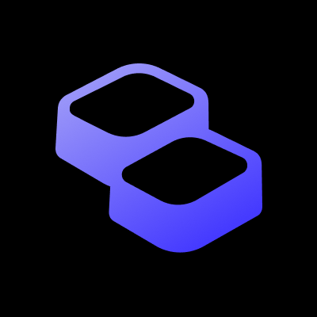

# 👋 Hi I am Sheng-Tso Chiu

> 我做橋梁：在成人與人之間，搭起理解之橋，通往共識之岸。 
> I build bridges: between people, building understanding to reach the shore of consensus.

- ⚙️機械背景轉向🖥️資訊領域（跨域實作與協作）
- 🧪 研究興趣：Machine Learning、Reinforcement Learning

## 📬Contact Me／聯絡我

- E-mail：chiushengzuo[at]gmail.com

## More About Me

<!--
**ZuoTso/ZuoTso** is a ✨ _special_ ✨ repository because its `README.md` (this file) appears on your GitHub profile.

Here are some ideas to get you started:

- 🔭 I’m currently working on ...
- 🌱 I’m currently learning ...
- 👯 I’m looking to collaborate on ...
- 🤔 I’m looking for help with ...
- 💬 Ask me about ...
- 📫 How to reach me: ...
- 😄 Pronouns: ...
- ⚡ Fun fact: ...
-->

